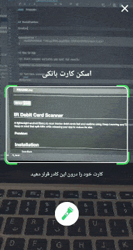

[](https://jitpack.io/#arefbhrn/IRDebitCardScanner)

## IR Debit Card Scanner

A lightweight android library to scan Iranian debit cards fast and realtime using Deep Learning and TensorFlow-Lite.
This library scans valid card numbers only.
Keep in mind that split ABIs while releasing your app to reduce its size.

To check stability and scan speed, check [STABILITY.md](./STABILITY.md) file.

####  Preview:



## Installation

Gradle:

```
dependencies {
    implementation 'com.github.arefbhrn:IRDebitCardScanner:1.0.0'
}
```

## How To Use

(1) Start scanner activity and wait for result:
``` 
ScanActivity.start(this);
```

(2) Retrieve scanned data:
```java
@Override
protected void onActivityResult(int requestCode, int resultCode, Intent data) {
    super.onActivityResult(requestCode, resultCode, data);

    if (ScanActivity.isScanResult(requestCode) && resultCode == Activity.RESULT_OK && data != null) {
        DebitCard scanResult = ScanActivity.debitCardFromResult(data);
        if (scanResult != null)
            Log.d("IRDCS", scanResult.number);
    }
}
```

- ##### {Debug Mode}

(1) Start scanner activity in debug mode:
``` 
ScanActivity.startDebug(this);
```
In this mode you will see a scanned preview while scanning.

- ##### {Alternative Texts}

(1) Start scanner activity with alternative texts:
``` 
ScanActivity.start(this, "IRDC Scanner",
        "Position your card in the frame so the card number is visible");
```
In this mode texts in scanner activity would be set as you prefer.

## Contact me

If you have a better idea or way on this project, please let me know. Thanks :) ?:

- [Email](mailto:arefprivate@gmail.com)
- [Website [En]](http://arefdev.ir/en) - [Website [Fa]](http://arefdev.ir)

License
---------------------------

This project is licensed under the GNU/GPL 3.0 License - see the [LICENSE.md](LICENSE.md) file for details
