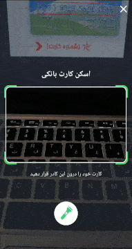
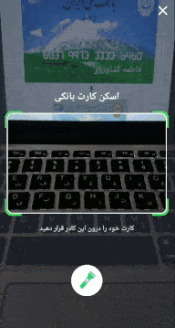
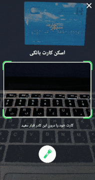
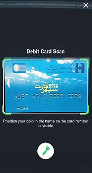
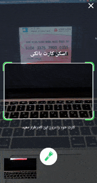

## IR Debit Card Scanner

A lightweight android library to scan Iranian debit cards fast and realtime using Deep Learning and TensorFlow-Lite.
This library scans valid card numbers only.

This file contains some examples to prove stability and scan speed.

---

| Ex. 1                  | Ex. 2                     | Ex. 3                     |
|---                     |---                        |---                        |
|   |       |      |
| Ex. 4                  | Alt text                  | Debug mode                |
|---                     |---                        |---                        |
|  |    |       |
